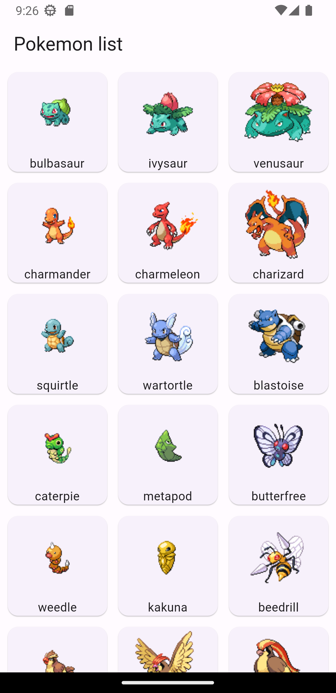

# Pokémon API Mobile App

Welcome to the Pokémon Mobile App GitHub repository! This project is a mobile application that interacts with the Pokémon API to provide users with a delightful experience exploring various Pokémon. The app is built using the Flutter framework and utilizes the `provider` and `http` packages to manage state and fetch data from the API.

## Features

The Pokémon Mobile App comes with the following features:

1. **Pokémon List Screen**: This screen displays a list of Pokémon fetched from the Pokémon API. The list is paginated, allowing users to scroll through a large collection of Pokémon. Each Pokémon item in the list provides a brief overview.

2. **Pokémon Details Screen**: When a user clicks on a Pokémon from the list, they are taken to a details screen that provides in-depth information about the selected Pokémon. This includes attributes such as type, abilities, and more.

## Screenshots

Here are a few screenshots from the app:

<div style="display: flex;">
  
  
</div>


## Installation

To run the Pokémon Mobile App locally on your machine, follow these steps:

1. Make sure you have Flutter installed. If not, follow the installation guide [here](https://flutter.dev/docs/get-started/install).

2. Clone this repository to your local machine using the following command:
```bash
git clone https://github.com/ADEL-tec/Pokemon-API.git
```
3. Navigate to the project directory:
```bash
cd pokemon-mobile-app
```
4. Install the required packages using Flutter:
```bash
flutter pub get
```
5. Run the app on an emulator or physical device:
```bash
flutter run
```

## Dependencies

The Pokémon Mobile App relies on the following Flutter packages:

- [`provider`](https://pub.dev/packages/provider): Used for state management and to efficiently pass data between different screens.

- [`http`](https://pub.dev/packages/http): Utilized to make HTTP requests to the Pokémon API and fetch the necessary data.

## Contributing

If you'd like to contribute to the Pokémon Mobile App, feel free to fork this repository, make changes, and submit a pull request. We welcome any improvements, bug fixes, or new features that you can bring to the project.

Please ensure that you follow the existing coding style and guidelines when submitting your contributions.

## Credits

This app was developed by [Adel Merioua](https://github.com/ADEL-tec).

## License

The Pokémon Mobile App is open-source software licensed under the [MIT License](LICENSE).
